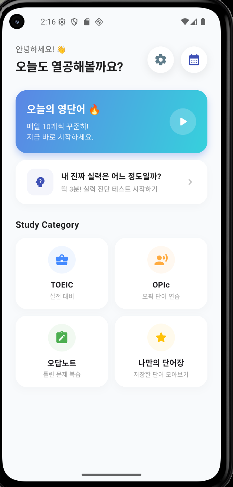
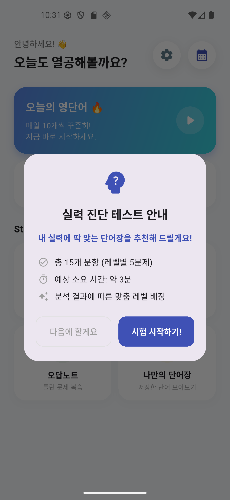
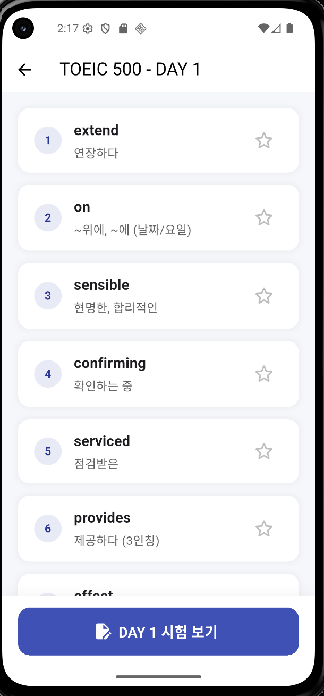
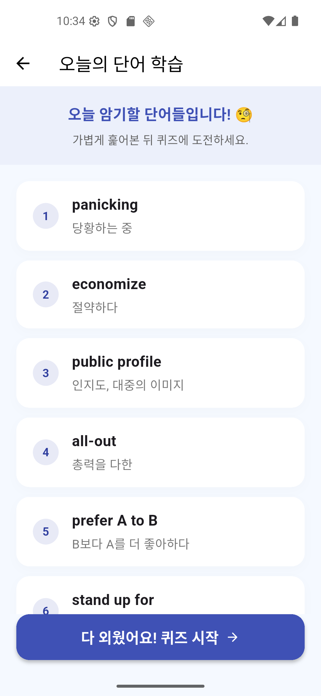
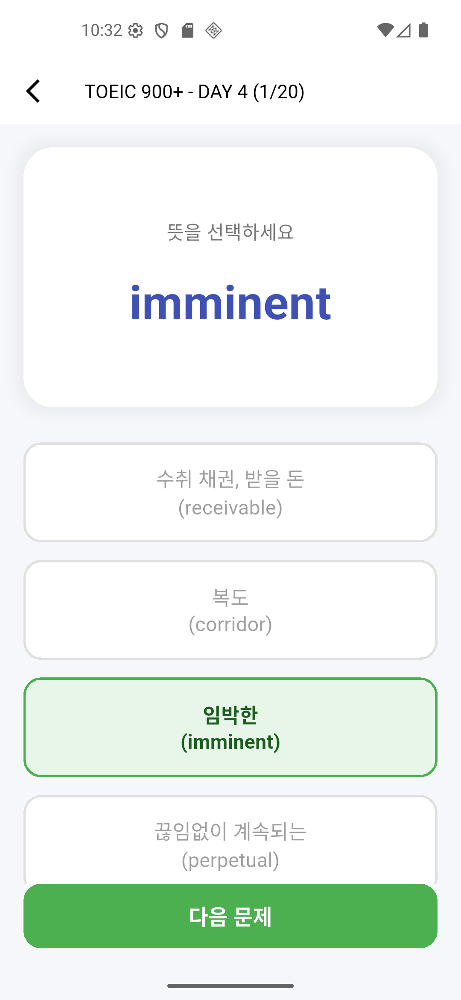
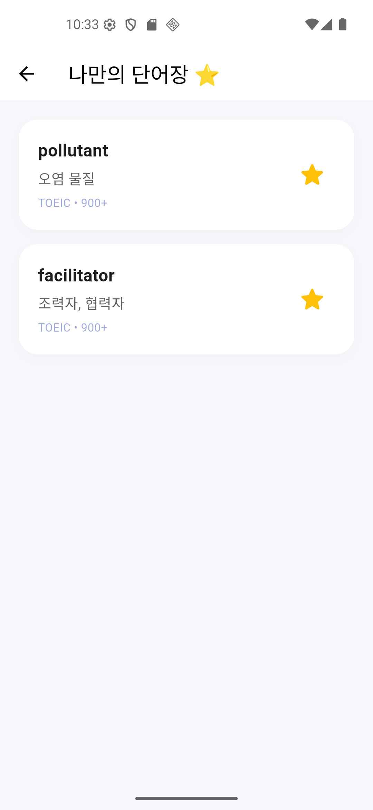
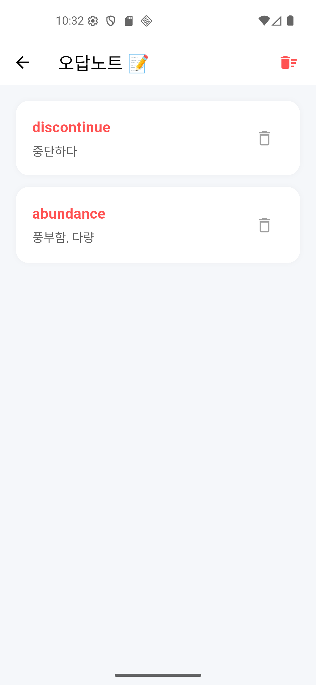
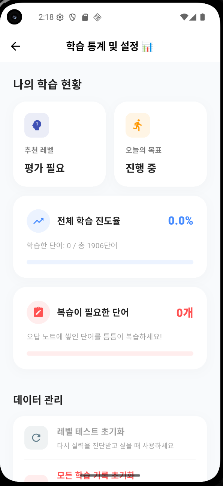

<p align="center">
  
</p>

# 📚 포켓보카 (Pocket Voca)

**나만의 맞춤형 영단어 학습 애플리케이션** 🚀
매일 꾸준하게, 내 실력에 딱 맞게 영단어를 정복해 보세요! 

플러터(Flutter)와 로컬 NoSQL 데이터베이스(Hive)를 활용하여 오프라인에서도 빠르고 쾌적하게 동작하도록 설계된 모바일 영단어장 앱입니다.

---

## ✨ 핵심 기능 (Key Features)

### 🎯 1. 실력 진단 테스트 및 맞춤 레벨 추천
* 15개의 진단 퀴즈를 통해 사용자의 현재 단어 수준을 파악합니다.
* 결과에 따라 TOEIC (500/700/900+) 알맞은 학습 레벨을 자동으로 추천해 줍니다.

### 🧠 2. 스마트 학습 시스템 (에빙하우스 망각곡선)
* **에빙하우스 망각곡선(Spaced Repetition) 알고리즘**을 도입하여 과학적인 복습 주기를 자동으로 계산합니다.
* 학습 결과에 따라 단어별 복습 단계(1~6단계)를 관리하며, 맞힐수록 복습 주기가 늘어납니다 (1일 → 2일 → 4일 → 7일 → 15일 → 30일).
* 틀린 단어는 즉시 학습 단계가 초기화되어 완벽하게 외울 때까지 반복 노출됩니다.

### 🔥 3. 오늘의 영단어 (Daily Study)
* 매일 10개의 단어를 추출하여 학습 목표로 제공합니다.
* 알고리즘에 따라 **복습이 필요한 단어를 최우선으로 배치**하고, 남은 자리를 새로운 단어로 채워 학습 효율을 극대화합니다.
* 10문제를 모두 맞혀야만 학습 완료(출석 도장)가 되는 시스템으로 꼼꼼한 암기를 유도합니다.

### 🎨 4. 감성적인 계절 테마 및 다크 모드
* **계절별 테마:** 현재 날짜에 맞춰 자동으로 변하거나 직접 선택할 수 있는 4계절(봄, 여름, 가을, 겨울) 테마를 제공합니다.
* **다크 모드:** 눈의 피로를 줄여주는 세련된 다크 모드를 완벽하게 지원합니다.
* **반응형 배경:** `SeasonalBackground`를 통해 각 테마에 맞는 그라데이션과 아이콘이 동적으로 적용됩니다.

### 🧩 5. 쾌적한 퀴즈 및 학습 환경
* 단어 카드 형태의 깔끔한 UI로 스와이프하며 단어를 학습합니다.
* **영어-한글 및 한글-영어 무작위 퀴즈** 시스템을 제공하며, 오답은 자동으로 분석되어 결과창에 상세히 표시됩니다.

### 📝 6. 오답 노트 및 나만의 단어장 (북마크)
* **오답 노트:** 퀴즈에서 틀린 단어들은 오답 노트 DB에 자동 저장되며, 집중 복습이 가능합니다.
* **나만의 단어장:** 학습 중 별표(⭐) 아이콘을 눌러 내가 외우고 싶은 단어만 따로 스크랩하여 모아볼 수 있습니다.

### 📊 7. 학습 통계 및 캘린더 연동
* `TableCalendar`를 통해 매일매일의 출석 및 학습 완료 현황을 한눈에 파악합니다.
* 전체 진도율과 추천 레벨, 오답 개수 등을 시각화된 리포트로 확인할 수 있습니다.

---

## 🛠 기술 스택 (Tech Stack)

* **Framework:** Flutter (Dart)
* **Local Database:** Hive (초고속 경량 NoSQL 로컬 DB)
* **State Management:** `ValueListenableBuilder`를 활용한 리액티브 UI 구현
* **Major Packages:**
  * `hive`, `hive_flutter`: 데이터 영속성 관리
  * `table_calendar`: 학습 기록 시각화
  * `intl`: 날짜 포맷팅 및 다국어 지원
  * `build_runner`, `hive_generator`: 코드 생성 자동화

---

## 📱 스크린샷 (Screenshots)

<p align="center">
  
  
  
  
</p>
<p align="center">
  
  
  
  
</p>

---

## 📂 프로젝트 구조 (Project Structure)

```text
lib/
├── main.dart                 # 앱 진입점 및 초기화
├── theme_manager.dart        # 계절별 테마 및 다크모드 관리
├── seasonal_background.dart  # 동적 배경 UI 컴포넌트
├── word_model.dart           # Hive 데이터 모델 (Spaced Repetition 로직 포함)
├── data_loader.dart          # 초기 데이터 로딩 및 배치 처리
├── study_record_service.dart # 학습 기록 및 캘린더 연동 서비스
└── *_page.dart               # 각 기능별 화면 구현 (학습, 퀴즈, 설정 등)
```

---

## ⚙️ 설치 및 실행 방법 (Getting Started)

```bash
# 1. 저장소를 클론합니다.
git clone https://github.com/your-username/my_vocab_app.git

# 2. 패키지를 설치합니다.
flutter pub get

# 3. 데이터 모델 코드를 생성합니다.
dart run build_runner build --delete-conflicting-outputs

# 4. 앱을 실행합니다.
flutter run
```

---

## 💡 주요 개발 포인트 (Development Highlights)

* **에빙하우스 망각곡선 엔진:** 사용자별 학습 데이터를 기반으로 망각 시점을 예측하고 복습 단어를 우선 노출하는 스마트 알고리즘을 구현했습니다.
* **대용량 데이터 로딩 최적화:** 1,900여 개의 단어 데이터를 초기화할 때 `putAll`을 활용한 배치 처리를 통해 성능을 극대화했습니다.
* **사용자 중심 UX:** 어디서든 홈으로 즉시 이동할 수 있는 직관적인 네비게이션과 학습 이어하기 기능을 제공합니다.
* **데이터 안전성:** 예외 처리를 통해 앱 업데이트나 기기 변경 시에도 데이터를 안전하게 보호하고 복구할 수 있도록 설계했습니다.
